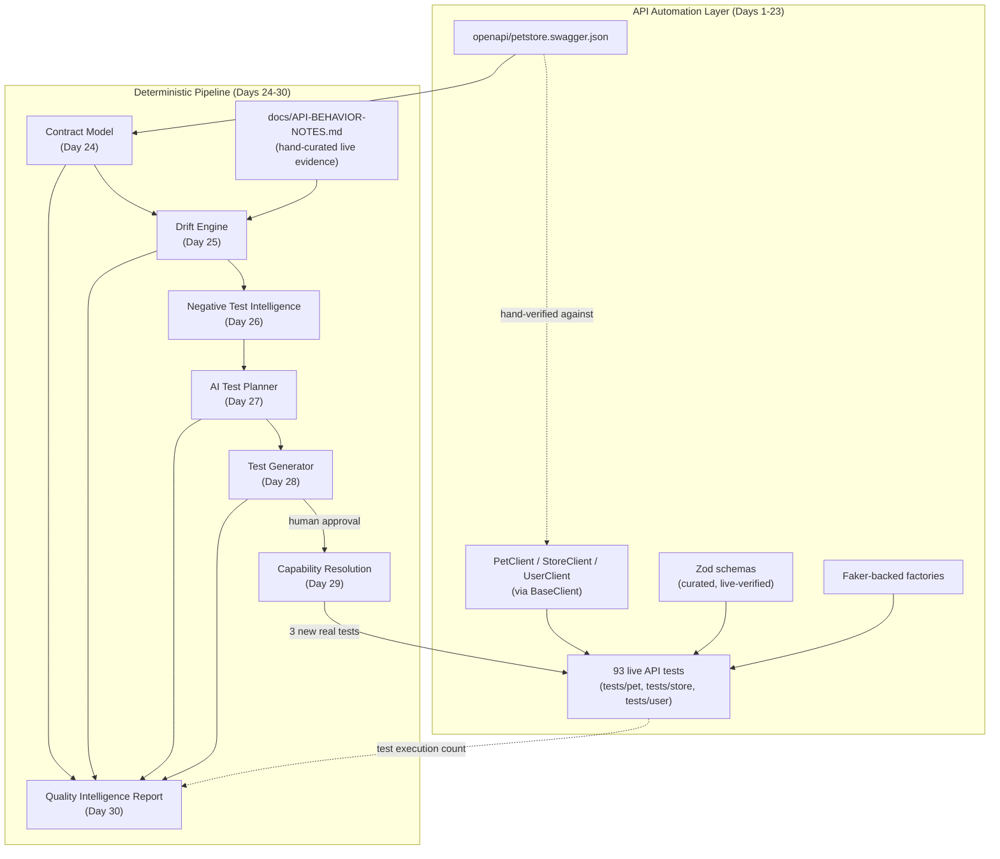

# Qualnexa MVP v1

This document is the Day 31 ("MVP Integration") deliverable, packaging what
Days 1–30 actually built into a single reference: architecture, components,
how to run it, real example output from every stage, known limitations,
security posture, and a near-term roadmap. Every number and claim below is
drawn from this repository's actual code and actual live-verified behavior —
none of it is projected or aspirational unless explicitly labeled as such.

## 1. Architecture

Two layers exist side by side: an **API automation layer** (Days 1–23) that
tests the live Swagger Petstore API, and a **deterministic AI-assisted QA
pipeline** (Days 24–30) that reasons about that API's OpenAPI contract and
this repository's own accumulated evidence — without ever calling an LLM or
making a network request of its own.



## 2. Component overview

| Component                                  | Purpose                                                                                                                                                                          | Day(s)                  |
| ------------------------------------------ | -------------------------------------------------------------------------------------------------------------------------------------------------------------------------------- | ----------------------- |
| `BaseClient`                               | Shared HTTP plumbing (JSON/multipart/form bodies, opt-in auth-header override, `ApiError`)                                                                                       | 1, 5, 6, 18, 19, 22, 29 |
| `PetClient` / `StoreClient` / `UserClient` | Thin, resource-scoped wrappers over `BaseClient`                                                                                                                                 | 1–19                    |
| `src/schemas/*.ts`                         | Zod schemas — the _curated, live-verified_ contract (deliberately diverges from the raw spec where live behavior proved the spec wrong)                                          | 1–23                    |
| `src/data/*.factory.ts`                    | Faker-backed, Qualnexa-tagged test-data factories                                                                                                                                | 1–23                    |
| `src/fixtures/api.fixtures.ts`             | Playwright fixture wiring for every client                                                                                                                                       | 1–29                    |
| `src/contract/`                            | **Contract Model** — a typed, mechanical transcription of what the OpenAPI spec _declares_                                                                                       | 24                      |
| `src/drift/`                               | **Drift Engine** — compares the Contract Model against a hand-curated `LiveEvidence` dataset of what's _actually proven_, producing typed `DriftFinding[]`                       | 25                      |
| `src/negative-tests/`                      | **Negative Test Intelligence** — reasons from contract + drift + existing coverage + prior decisions into `NegativeTestCandidate[]`, explicitly rejecting/deferring most of them | 26                      |
| `src/ai-test-planner/`                     | **AI Test Planner** — adds risk/coverage/redundancy judgment and a final `MUST`/`SHOULD`/`OPTIONAL`/`REJECT` verdict per candidate                                               | 27                      |
| `src/test-generator/`                      | **Test Generator** — turns approved plan items into structured `TestImplementationProposal`s, honestly classifying what's `IMPLEMENTABLE` vs. blocked                            | 28                      |
| `src/quality-report/`                      | **Quality Intelligence Report** — aggregates every stage above plus a caller-supplied test-execution count                                                                       | 30                      |
| `tests/integration/full-pipeline.spec.ts`  | Proves the 6 stages above compose correctly end-to-end, not just in isolation                                                                                                    | 31                      |

**"AI" in this codebase never means an embedded LLM/API SDK.** Per `CLAUDE.md`'s own architecture decision, "AI-assisted" means the agentic session driving each day's work reasons over the deterministic pipeline's output and hand-authors the judgment-heavy fields (`live-evidence.ts`, `candidate-seeds.ts`, `plan-annotations.ts`, `implementation-notes.ts`, `report-annotations.ts`) — the same pattern repeated five times, Days 25–30.

## 3. CLI / workflow usage

```bash
npm install                 # install dependencies
npm test                     # run all 95 tests (93 pre-existing + 2 new integration tests)
npx playwright test --list   # list every test without running it
npm run typecheck            # tsc --noEmit
npm run lint                 # eslint .
npm run format:check         # prettier --check .
```

There is no separate "run the pipeline" CLI command by design (see §6, Future roadmap) — every pipeline stage is a plain, importable TypeScript function (e.g. `loadContractModel()`, `detectDriftFromCachedSources()`), and `tests/integration/full-pipeline.spec.ts` is itself the runnable demonstration: running `npm test` executes the complete chain and asserts on its real output.

## 4. Example output from every stage (real, captured this session)

```
Stage 1 — Contract Model:        20 operations, 6 definitions
Stage 2 — Drift Engine:          25 findings
                                  STATUS_CODE_MISMATCH: 10   REQUIRED_FIELD_NOT_ENFORCED: 3
                                  ENUM_NOT_ENFORCED: 2       SECURITY_NOT_ENFORCED: 9
                                  COLLECTION_FORMAT_MISMATCH: 1
                                  severity — P0: 11   P1: 12   P2: 2
Stage 3 — Negative Test Intel:   9 candidates — CANDIDATE: 2   DEFERRED: 2   REJECTED: 5
Stage 4 — AI Test Planner:       9 plan items — MUST: 2   OPTIONAL: 2   REJECT: 5
Stage 5 — Test Generator:        4 proposals — IMPLEMENTABLE: 1   NEEDS_CLIENT_CAPABILITY: 2
                                  DEFERRED: 1
Stage 5→6 handoff (Day 29):      3 of those 4 proposals are now real, committed, passing tests
                                  (addPet-missing-required-fields, getInventory-security-not-enforced,
                                  findByStatus-collection-format); declared-but-unobserved-400s
                                  remains DEFERRED
Stage 6 — Quality Report:        16/20 operations automated, 4 intentionally not
                                  (findPetsByTags, logoutUser, createUsersWithArrayInput,
                                  createUsersWithListInput)
Live execution:                  95 tests, 0 failed (as of this document)
```

## 5. Known limitations — implemented vs. deferred

**Implemented and working today:**

- All 6 pipeline stages, chained and verified (this document, `tests/integration/full-pipeline.spec.ts`).
- 3 of Day 28's 4 implementation proposals converted into real, committed tests (Day 29).
- A narrowly-scoped, opt-in `BaseClient` auth-header override (Day 29) — process-wide `env`-based auth (Day 22) plus a per-instance override, both fully backward compatible.

**Explicitly deferred, not overlooked:**

- `declared-but-unobserved-400s` — needs new live verification (trying more input shapes on `getPetById`/`getOrderById`/`getUserByName`) before it can even become a concrete test; asserting an outcome without that evidence would be inventing behavior.
- `NEEDS_SCHEMA_CHANGE` as an `implementationStatus` — defined in the schema, never actually triggered by a real finding to date; no proposal so far has required weakening an existing Zod schema, and none should be forced to.
- A generalized, reusable `AuthProvider`/multi-scheme abstraction — Day 22/29 built exactly the one narrow mechanism a real need justified (a single header override); OAuth2 client-credentials and a full strategy-class hierarchy remain explicitly un-built until a second real client engagement provides concrete evidence for them.
- A fully automated, no-human-review generation pipeline — `CLAUDE.md`'s own "Explicitly deferred" section still governs this; every stage in this pipeline stops for human approval before any code is written, exactly as the original Days 21–30 brief required ("Human approval must remain between AI recommendation and code modification").
- Multi-environment configuration (`config/env/<name>.env`) — still no second real environment exists.
- A shared, extractable `@qualnexa/api-test-core` package — still no second consuming project exists.

## 6. Security considerations

- **No real credentials exist anywhere in this repository.** The Day 22/29 auth-header mechanism's only real-world use is a hardcoded, obviously-fake test value (`tests/store/inventory-with-invalid-auth.spec.ts`), never a real secret.
- **No LLM/API SDK, no external network dependency beyond the target API itself.** The entire Days 24–30 pipeline runs locally, offline, deterministically.
- **The target API itself (Swagger Petstore) has no real authentication** — a live-verified, extensively documented fact (`docs/API-BEHAVIOR-NOTES.md`, cross-cutting finding #2), not a gap in this framework. This is explicitly why Day 29's auth-header test proves non-enforcement rather than enforcement.
- **`.env` is gitignored**; `config/env.ts`'s defaults are safe (a public demo URL, a timeout, both non-secret) per `CLAUDE.md`'s own stated policy.

## 7. Future roadmap (not yet built, explicitly future)

Carried forward from Day 20's own architecture review, still valid:

- **Phase B — Auth capability generalization**: only if a real client engagement needs more than the single-header override built so far.
- **Phase D — Contract/drift automation in CI**: running the Drift Engine as a CI gate that fails a build when a spec refresh introduces new, previously-unseen drift — not yet justified at this repository's current scale (one target API, infrequent spec changes).
- **Phase H — Formalizing the discovery→verify→propose→implement playbook** into semi-automated tooling for a second real client, still with mandatory human approval at every stage, per this document's own §5.
- **Phase G — Reporting/observability**: trend tracking across multiple `QualityReport` snapshots over time, once there's more than one snapshot's worth of history to compare.

## 8. Code-quality review (Days 24–30 pipeline)

Reviewed `src/contract/`, `src/drift/`, `src/negative-tests/`, `src/ai-test-planner/`, `src/test-generator/`, `src/quality-report/`, and their test files for consistency:

- **Consistent pattern across all 6 modules**: a Zod schema file, a curated hand-authored data file (where judgment is needed), a pure assembler function with a `...FromCachedSources()` convenience wrapper, and a local/network-free test file. No module deviates from this shape.
- **Consistent fail-loud discipline**: every assembler throws on a stale or unknown reference (`detect-drift.ts`, `generate-candidates.ts`, `build-test-plan.ts`, `generate-implementation-proposals.ts`, `build-quality-report.ts`) rather than silently dropping data — verified by a dedicated test in each stage's spec file.
- **No duplicated logic**: each stage consumes the previous stage's real typed output rather than re-deriving facts already established (e.g., the Quality Report pulls `declared`/`observed` from real `DriftFinding` entries rather than re-encoding them).
- **One minor, deliberate inconsistency, already documented at the time**: `tests/quality-report/build-quality-report.spec.ts` uses a fixed `testExecution` value of `{ total: 82, ... }` (accurate when written, before Day 30 itself added 11 tests) while this day's integration test uses `{ total: 95, ... }` — both are intentionally static, illustrative inputs to a pure function, not live counts, so neither is "wrong," but a future reader should not assume either number reflects the _current_ test count without checking `npx playwright test --list`.
- **No dead code, no unused exports found** across the 6 modules during this review.
